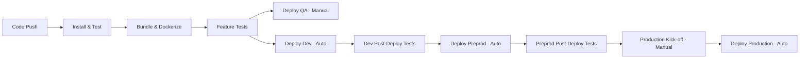

# Deployment - upload-service

## Overview

The upload-service uses GitLab CI/CD for automated testing, building, and deployment. Infrastructure is managed through Terraform with the Terramisu wrapper, and the application is packaged as Docker containers stored in AWS ECR.

## CI/CD Pipeline

### Pipeline Technology

- **CI/CD Platform**: GitLab CI
- **Configuration**: `.gitlab-ci.yml`
- **Container Registry**: AWS ECR (`889199535989.dkr.ecr.us-east-1.amazonaws.com`)
- **Base Image**: `tmhub.io/verifiedfan/node18-base:18.18.2-alpine-latest`

### Pipeline Stages

The deployment pipeline consists of the following stages:

1. **destroy** - Manual infrastructure teardown
2. **install** - Dependency installation and ECR repository setup
3. **test** - Code quality and unit tests
4. **bundle** - Application bundling
5. **dockerize** - Docker image build and push
6. **qa environments** - QA environment deployment
7. **features** - Feature test execution
8. **dev pre deploy** - Dev environment preparation (database indexes)
9. **dev deploy** - Dev environment deployment
10. **dev post deploy** - Dev environment validation
11. **preprod pre deploy** - Preprod preparation
12. **preprod deploy** - Preprod deployment
13. **preprod post deploy** - Preprod validation
14. **production kick-off** - Manual approval gate for production
15. **production pre deploy** - Production preparation
16. **production deploy** - Production deployment
17. **cleanup** - Pipeline artifact cleanup

### GitLab Runners

Different runners are used for different environments:

| Runner Tag | Purpose | Environments |
|------------|---------|--------------|
| `tm-prod terraformer` | Build and production | Build, Prod |
| `tm-nonprod terraformer` | Non-production | Dev, QA |
| `tm-prod terraformer preprod` | Pre-production | Preprod |

## Build Process

### Dependency Installation

**Job**: `yarn`
- **Stage**: install
- **Actions**:
  - Install Node.js dependencies via Yarn
  - Cache dependencies in `.yarn-cache` for faster builds
- **Artifacts**: `node_modules`, `configs/build.config.yml` (24h expiry)
- **Cache Strategy**: Branch-level caching for Yarn packages

### Code Quality & Testing

| Job | Purpose | Stage |
|-----|---------|-------|
| **eslint** | JavaScript linting | test |
| **yaml lint** | YAML validation | test |
| **server-uts** | Server unit tests | test |
| **lib-uts** | Library unit tests | test |

All tests must pass before proceeding to build stages.

### Application Bundle

**Job**: `bundle`
- **Stage**: bundle
- **Command**: `npx run bundle`
- **Output**: `dist/` directory (24h expiry)

### Docker Image Build

**Job**: `dockerize`
- **Stage**: dockerize
- **Image**: `tmhub.io/verifiedfan/docker-builder:focal-node18-latest`
- **Steps**:
  1. Calculate build version: `npx run buildVersion:calculate`
  2. Build Docker image: `npx run docker:build`
  3. Push to ECR: `npx run docker:compose push`
  4. Clean up: Remove local images
- **Artifacts**: `buildVersion` file (1 month expiry)
- **Registry**: AWS ECR
- **Image Tag**: Based on Git commit/branch

### ECR Repository Setup

**Job**: `create repo`
- **Stage**: install
- **Purpose**: Ensure ECR repository exists
- **Command**: `docker run --rm tmhub.io/ticketmaster/ecr-createrepo titan/upload-service`

## Environment Configuration

### Environment Definitions

| Environment | AWS Account | Region | Subnet Tier | DNS Zone |
|-------------|-------------|--------|-------------|----------|
| **dev1** | tm-nonprod | us-east-1 | web | nonprod-tmaws.io |
| **qa1** | tm-nonprod | us-east-1 | web | nonprod-tmaws.io |
| **preprod1** | tm-prod | us-east-1 | web | prod-tmaws.io |
| **prod1** | tm-prod | us-east-1 | web | pub-tmaws.io |

### Environment URLs

| Environment | EC2 URL | Kubernetes FQDN (if applicable) |
|-------------|---------|--------------------------------|
| **qa1** | `upload-service-qa1-us-east-1.titan.nonprod-tmaws.io` | `uploads-qa1-us-east-1.titan.nonprod-tmaws.io` |
| **dev1** | `upload-service-dev1-us-east-1.titan.nonprod-tmaws.io` | `uploads-dev1-us-east-1.titan.nonprod-tmaws.io` |
| **preprod1** | `upload-service-preprod1-us-east-1.titan.pub-tmaws.io` | `uploads-preprod1-us-east-1.titan.prod-tmaws.io` |
| **prod1** | `upload-service-prod1-us-east-1.titan.pub-tmaws.io` | `uploads-prod1-us-east-1.titan.pub-tmaws.io` |

## Terraform Deployment

### Terraform Configuration

- **Tool**: Terramisu (Terraform wrapper)
- **Version**: v1.8.3 (`prod.tmhub.io/prod/techops-tools/terramisu:v1.8.3`)
- **State Backend**: S3 (managed via `terraform_backend.tf`)
- **Infrastructure Path**: `terraform/` directory

### Deployment Command Structure

```bash
terramisu apply -e tm-{ACCOUNT}/{ENV} -- \
  -var app_instance_artifact_version={BUILD_VERSION} \
  -var app_instance_image=titan/upload-service \
  -var app_elb_dns_alias_name=uploads
```

### Deployment Jobs

#### QA Environment

**Job**: `deploy qa1 ec2`
- **Trigger**:
  - Automatic on `develop` branch
  - Manual for other branches
- **Stage**: qa environments
- **Variables**: `AWS_ACCOUNT=nonprod`, `AWS_REGION=us-east-1`, `TERRAFORM_ENV=qa1`

#### Dev Environment

**Job**: `deploy dev1 ec2`
- **Trigger**: Automatic on `develop` branch
- **Stage**: dev deploy
- **Variables**: `AWS_ACCOUNT=nonprod`, `TERRAFORM_ENV=dev1`

#### Preprod Environment

**Job**: `deploy preprod1 ec2`
- **Trigger**: Automatic on `develop` branch
- **Stage**: preprod deploy
- **Variables**: `AWS_ACCOUNT=prod`, `TERRAFORM_ENV=preprod1`

#### Production Environment

**Job**: `deploy prod1 ec2`
- **Trigger**: Manual approval (via `prod kick off` gate)
- **Stage**: production deploy
- **Variables**: `AWS_ACCOUNT=prod`, `TERRAFORM_ENV=prod1`
- **Failure**: Not allowed to fail

### Pre-Deployment Steps

**Database Index Creation**:
- **Jobs**: `dev db indexes`, `preprod db indexes`, `production db indexes`
- **Purpose**: Ensure MongoDB indexes are created before deployment
- **Command**: `DEBUG='titan:lib:config' DEBUG_DEPTH=8 npx run createMongoIndexes`
- **Environment Variable**: `NODE_ENV` set to target environment

### Terraform Lock Management

Manual jobs to release Terraform state locks if needed:

| Job | Environment | Stage |
|-----|-------------|-------|
| `release lock qa1` | qa1 | qa environments |
| `release lock dev1` | dev1 | dev pre deploy |
| `release lock preprod1` | preprod1 | preprod pre deploy |
| `release lock prod1` | prod1 | production pre deploy |

## Post-Deployment Validation

### Feature Testing

After each environment deployment, automated feature tests run:

**Deployed Environment Tests**:
- **Jobs**: `dev features`, `preprod features`
- **Command**: `DEBUG='titan:lib:config' DEBUG_DEPTH=8 npx run features`
- **Artifacts**: Test reports in `reports/` directory
- **Retry**: Up to 1 retry on failure

**MonoQL Integration Tests**:
- **Jobs**: `dev monoql features`, `preprod monoql features`
- **Purpose**: Test GraphQL integration via separate MonoQL repo
- **Process**:
  1. Clone MonoQL repo: `git clone https://git.tmaws.io/Titan/monoql.git`
  2. Install dependencies
  3. Run integration tests
- **Artifacts**: Reports stored for 1 week

### Docker Compose Testing

**Job**: `features`
- **Stage**: features
- **Purpose**: Integration testing via Docker Compose
- **Steps**:
  1. Pull Docker image: `npx run docker:compose pull`
  2. Run all feature tests: `npx run docker:features reports/all`
  3. Run infrastructure tests: `npx run docker:features reports/infrastructure "--tags @infrastructure"`
- **Artifacts**: Test reports and Docker logs (8h expiry)
- **Retry**: Up to 1 retry

## S3 Bucket Deployment

Separate Terraform configuration for S3 buckets:

### S3 Deployment Jobs

| Job | Environment | Trigger | Path |
|-----|-------------|---------|------|
| `deploy s3 dev1` | dev1 | Manual | `terraform-s3/` |
| `deploy s3 preprod1` | preprod1 | Manual | `terraform-s3/` |
| `deploy s3 prod1` | prod1 | Manual | `terraform-s3/` |

**Command**: `terramisu apply -e tm-{ACCOUNT}/{ENV}`

These jobs deploy/update S3 buckets independently from EC2 infrastructure.

## Deployment Workflow

### Development Flow (Develop Branch)



### Production Deployment Gate

**Job**: `prod kick off`
- **Stage**: production kick-off
- **Trigger**: Manual approval required
- **Purpose**: Explicit human approval before production deployment
- **Dependency**: Requires successful `dockerize` job

## Infrastructure Teardown

### Destroy Jobs

Manual jobs to tear down environment infrastructure:

| Job | Environment | Stage | Trigger |
|-----|-------------|-------|---------|
| `destroy qa1 ec2` | qa1 | destroy | Manual |
| `destroy dev1 ec2` | dev1 | destroy | Manual (`develop` only) |
| `destroy preprod1 ec2` | preprod1 | destroy | Manual (`develop` only) |
| `destroy prod1 ec2` | prod1 | destroy | Manual (`develop` only) |

**Command**: `terramisu destroy -e tm-{ACCOUNT}/{ENV}`

## Pipeline Optimization

### Caching Strategy

- **Yarn Cache**: Branch-level caching in `.yarn-cache/` directory
- **Dependencies**: Cached `node_modules` passed as artifacts (24h)
- **Build Version**: Preserved for 1 month for debugging

### Artifact Cleanup

**Job**: `docker cleanup`
- **Stage**: cleanup
- **Trigger**: Always runs at end of pipeline
- **Purpose**: Clean up local Docker images to free runner disk space
- **Failure**: Allowed (doesn't block pipeline)

## Deployment Variables

### Global Variables

| Variable | Value | Purpose |
|----------|-------|---------|
| `ECR_HOST` | `889199535989.dkr.ecr.us-east-1.amazonaws.com` | ECR registry URL |
| `SHORTREPO` | `titan/upload-service` | Repository short name |
| `IMAGE_NAME` | `${ECR_HOST}/${SHORTREPO}` | Full image name |
| `TERRAMISU_IMAGE` | `prod.tmhub.io/prod/techops-tools/terramisu:v1.8.3` | Terraform wrapper image |
| `DNS_ALIAS_NAME` | `uploads` | DNS alias prefix |

### Kubernetes Variables (Future/Alternative Deployment)

The pipeline includes Kubernetes-related variables for potential future use:

- `K8S_NAMESPACE`: `prd1541`
- `HELM_RELEASE_NAME`: `upload-svc`
- `CHART_REPO`: `tm/webservice`
- `CHART_VERSION`: `0.18.0`

## Deployment Best Practices

### Branch Strategy

- **develop**: Auto-deploys to dev, preprod; requires manual approval for QA and production
- **Other branches**: Manual deployment only (for testing)

### Deployment Dependencies

Each deployment job depends on:
1. Successful `dockerize` job (build version artifact)
2. Pre-deployment jobs (database indexes)
3. Previous environment validation (for progressive deployment)

### Rollback Strategy

- **Infrastructure**: Terraform state allows rollback via version pinning
- **Application**: Redeploy previous `BUILD_VERSION` via manual Terraform apply
- **Emergency**: Use `destroy` jobs and redeploy from known-good state

## Monitoring Deployment Status

### GitLab Environments

Each deployment creates a GitLab environment with:
- **Environment URL**: Direct link to deployed service
- **Stop Action**: Linked to destroy job for cleanup
- **Deployment History**: Visible in GitLab UI

### Deployment Artifacts

- **Build Version**: Tagged in ECR and stored as artifact
- **Test Reports**: Available for download from pipeline
- **Terraform State**: Stored in S3 backend
